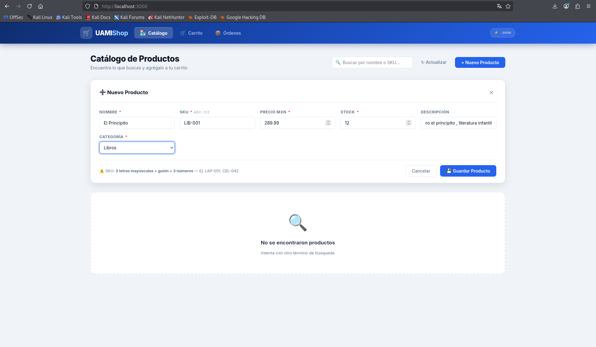
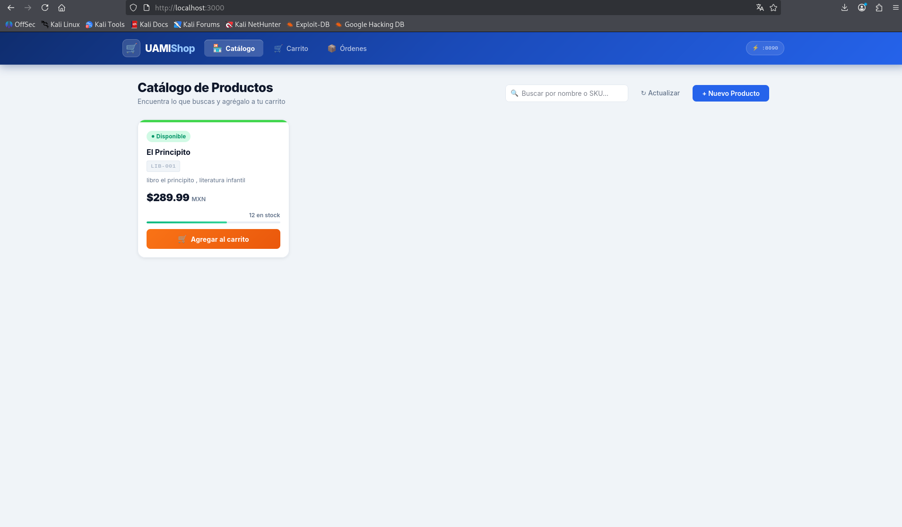
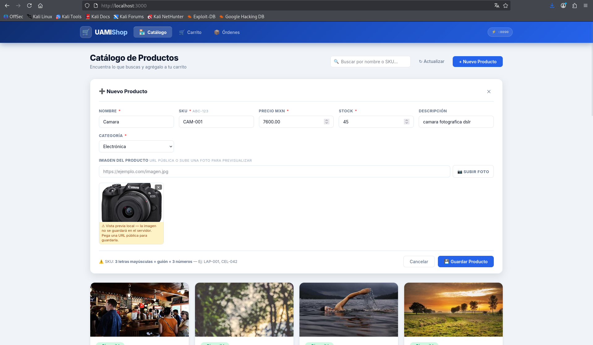
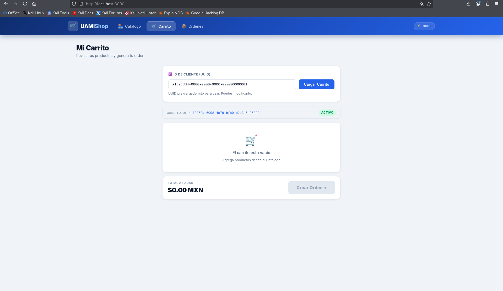
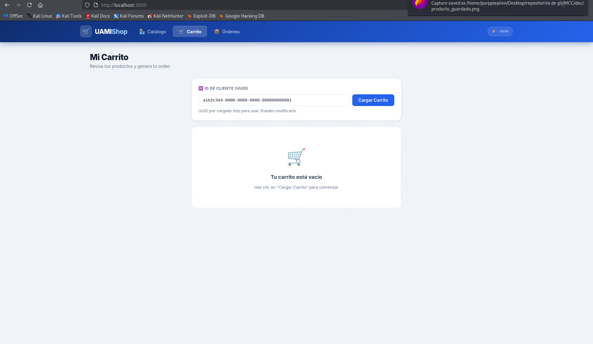
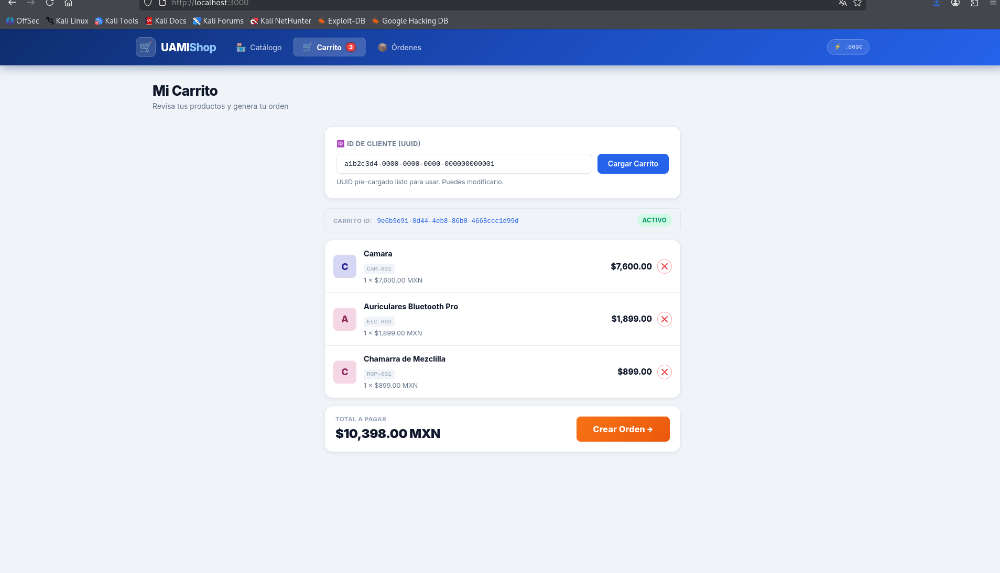
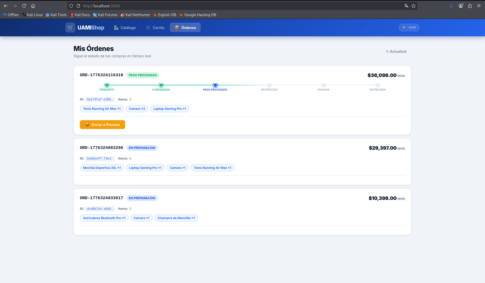
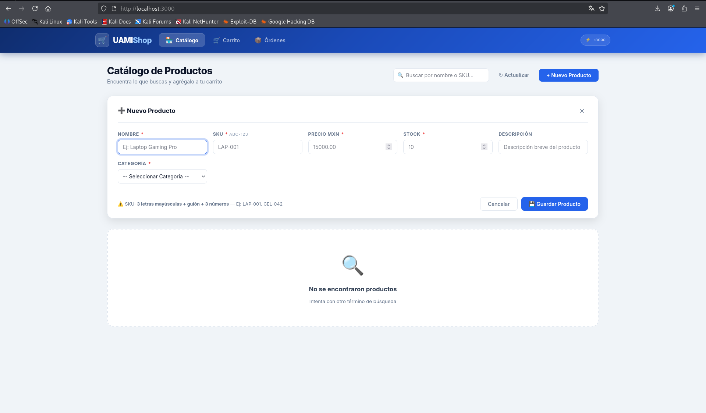

# UAMIShop — Sistema de Comercio Electrónico con Microservicios

<p align="center">
  
  
  
  
  
  
</p>

UAMIShop es un sistema de comercio electrónico desarrollado con arquitectura de microservicios. Permite gestionar un catálogo de productos, administrar carritos de compra y procesar órdenes, todo orquestado con Docker Compose y comunicado mediante RabbitMQ.

---

## Capturas de pantalla

### Catálogo de productos


### Producto guardado en el catálogo


### Producto con imagen agregada


### Carrito de compras activo


### Página del carrito con productos


### Crear orden desde el carrito


### Panel de órdenes con seguimiento de estado


### Vista del catálogo vacío


---

## Arquitectura

```
┌─────────────┐        HTTP        ┌──────────────────┐
│  Navegador  │ ──────────────────▶│  uamishop-nginx  │
│  (puerto    │                    │   (puerto 3000)  │
│   3000)     │                    └──────────────────┘
└─────────────┘                             │
                                    sirve archivos
                                    estáticos JS/HTML
                                            │
                              fetch a localhost:8090
                                            ▼
                               ┌────────────────────┐
                               │  uamishop-gateway  │
                               │    (puerto 8090)   │
                               │  Spring Cloud GW   │
                               └────────────────────┘
                          ┌────────────┼────────────┐
                          ▼            ▼            ▼
               ┌──────────────┐ ┌──────────┐ ┌──────────────┐
               │   catalogo   │ │ ordenes  │ │   ventas     │
               │  (8081)      │ │  (8082)  │ │   (8083)     │
               │  Productos   │ │ Órdenes  │ │  Carritos    │
               │  Categorías  │ └──────────┘ └──────────────┘
               └──────────────┘       │              │
                      │               └──────┬───────┘
                      │                      ▼
                      │          ┌───────────────────────┐
                      └─────────▶│    MySQL  (3306)      │
                                 │    Base de datos       │
                                 │    compartida          │
                                 └───────────────────────┘
                                           │
                                 ┌─────────────────────┐
                                 │  RabbitMQ  (5672)   │
                                 │  Mensajería asínc.  │
                                 └─────────────────────┘
```

---

## Servicios y puertos

| Servicio            | Puerto | Tecnología              | Responsabilidad                        |
|---------------------|--------|-------------------------|----------------------------------------|
| `uamishop-frontend` | 3000   | nginx + HTML/JS/CSS     | Interfaz de usuario                    |
| `uamishop-gateway`  | 8090   | Spring Cloud Gateway    | Enrutamiento y CORS centralizado       |
| `uamishop-catalogo` | 8081   | Spring Boot + JPA       | Productos, categorías e imágenes       |
| `uamishop-ordenes`  | 8082   | Spring Boot + JPA       | Ciclo de vida de órdenes               |
| `uamishop-ventas`   | 8083   | Spring Boot + JPA       | Carritos de compra                     |
| `mysql`             | 3306   | MySQL 8.0               | Persistencia de datos                  |
| `rabbitmq`          | 5672 / 15672 | RabbitMQ 3 Management | Mensajería asíncrona entre servicios |

---

## Requisitos

- [Docker](https://docs.docker.com/get-docker/) >= 20.x
- [Docker Compose](https://docs.docker.com/compose/) >= 2.x
- 4 GB de RAM disponibles (los servicios compilan dentro de Docker)

---

## Instalación y ejecución

```bash
# 1. Clonar el repositorio
git clone <url-del-repositorio>
cd MCC

# 2. Levantar todos los servicios (primera vez: ~8-10 min compilando)
docker-compose up --build

# 3. Abrir la aplicación
xdg-open http://localhost:3000
```

Al primer arranque con la base de datos vacía, el servicio `uamishop-catalogo` inserta automáticamente **8 categorías** y **18 productos de ejemplo** con imágenes.

### Reinicio limpio (borra la base de datos)

```bash
docker-compose down -v
docker-compose up --build
```

### Solo reconstruir código sin borrar datos

```bash
docker-compose down
docker-compose up --build
```

---

## Endpoints del API Gateway (`:8090`)

Todos los microservicios son accesibles a través del gateway en `http://localhost:8090`.

### Catálogo
| Método | Ruta                        | Descripción                        |
|--------|-----------------------------|------------------------------------|
| GET    | `/api/v1/productos`         | Listar todos los productos         |
| POST   | `/api/v1/productos`         | Crear un nuevo producto            |
| GET    | `/api/v1/productos/{id}`    | Obtener producto por ID            |
| PUT    | `/api/v1/productos/{id}`    | Actualizar producto                |
| GET    | `/api/v1/categorias`        | Listar todas las categorías        |
| POST   | `/api/v1/categorias`        | Crear una nueva categoría          |

### Ventas (Carrito)
| Método | Ruta                                         | Descripción                  |
|--------|----------------------------------------------|------------------------------|
| POST   | `/api/v1/carritos?clienteId={uuid}`          | Crear o recuperar carrito    |
| POST   | `/api/v1/carritos/{id}/productos`            | Agregar producto al carrito  |
| DELETE | `/api/v1/carritos/{id}/productos/{prodId}`   | Eliminar producto del carrito|

### Órdenes
| Método | Ruta                               | Descripción              |
|--------|------------------------------------|--------------------------|
| GET    | `/api/v1/ordenes`                  | Listar todas las órdenes |
| POST   | `/api/v1/ordenes`                  | Crear orden desde carrito|
| PATCH  | `/api/v1/ordenes/{id}/confirmar`   | Confirmar orden          |
| PATCH  | `/api/v1/ordenes/{id}/pago`        | Procesar pago            |
| PATCH  | `/api/v1/ordenes/{id}/en-proceso`  | Marcar en proceso        |

---

## Verificación de salud

```bash
# Estado de todos los contenedores
docker ps

# Health de cada microservicio
curl http://localhost:8081/actuator/health   # catalogo
curl http://localhost:8082/actuator/health   # ordenes
curl http://localhost:8083/actuator/health   # ventas
curl http://localhost:8090/actuator/health   # gateway

# Prueba del gateway
curl http://localhost:8090/api/v1/productos
curl http://localhost:8090/api/v1/categorias

# RabbitMQ Management UI
xdg-open http://localhost:15672  # usuario: guest / contraseña: guest

# Logs de un servicio específico
docker logs uamishop-catalogo -f
```

---

## Estructura del proyecto

```
MCC/
├── docker-compose.yml            # Orquestación de todos los servicios
├── uamishop-catalogo/            # Microservicio: productos y categorías
│   ├── Dockerfile
│   └── src/main/
│       └── resources/application.yml
├── uamishop-ordenes/             # Microservicio: órdenes
│   ├── Dockerfile
│   └── src/main/
│       └── resources/application.properties
├── uamishop-ventas/              # Microservicio: carritos de compra
│   ├── Dockerfile
│   └── src/main/
│       └── resources/application.yml
├── uamishop-gateway/             # API Gateway (Spring Cloud Gateway)
│   ├── Dockerfile
│   └── src/main/
│       └── resources/application.yml
├── uamishop-frontend/            # Frontend estático (nginx)
│   ├── Dockerfile
│   └── public/
│       ├── index.html
│       ├── app.js
│       └── styles.css
├── karate-tests/                 # Pruebas de integración con Karate
└── doc/                          # Documentación y capturas de pantalla
    └── DOCUMENTACION.md
```

---

## Documentación técnica

Ver [doc/DOCUMENTACION.md](doc/DOCUMENTACION.md) para documentación técnica completa: arquitectura detallada, configuración, eventos RabbitMQ, decisiones de diseño y resolución de problemas.

---

## Autor

**Antonio Soria** — antonio.soria8r@gmail.com

---

## Licencia

MIT
